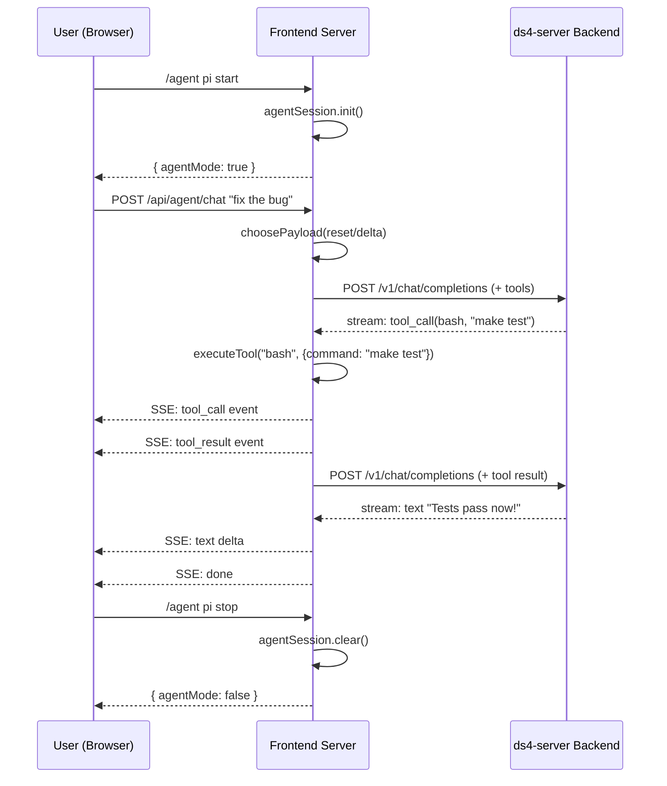

# Agentic Tooling Mode for DS4 Studio Frontend

Aggiungere al frontend di DS4 Studio la capacità di entrare/uscire da una modalità agentica ("pi agent") tramite comandi slash nel composer (`/agent pi start`, `/agent pi stop`). In modalità agentica, il frontend dialoga con il ds4-server usando il protocollo stateful delta/reset di `pi-ds4-stateful`, con sessioni che seguono il flusso già presente nel frontend (session management, history, export).

## User Review Required

> [!IMPORTANT]
> **Scelta architetturale**: Il pi-ds4-stateful attualmente è un'estensione per il runtime Pi CLI (`@earendil-works/pi-coding-agent`). Nel frontend web non abbiamo accesso a quel runtime. Propongo di reimplementare il protocollo stateful delta/reset **direttamente nel frontend server** (Express), ispirandomi alla logica di `session-state.ts` e `provider.ts` del package Pi. Questo evita di dipendere da Pi CLI nel contesto web. Confermi?

> [!WARNING]
> **Tool definitions**: Il ds4-agent nativo (`ds4_agent.c`) usa tool DSML (bash, read, write, edit, search, list). Il ds4-server OpenAI-compatible usa tool_calls OpenAI-style. Per la modalità agentica nel frontend, il modello invocherà tool calls OpenAI che il frontend server dovrà eseguire (bash, read, write, edit). Questo richiede un tool executor server-side. Nella prima versione propongo di supportare un sottoinsieme: **bash** (esecuzione comandi) e **read** (lettura file), con tool results mostrati nel flusso chat. Vuoi il set completo (bash, read, write, edit, search, list) fin da subito?

## Open Questions

1. **Endpoint backend**: Il ds4-server sulla porta 8002 supporta già `/v1/ds4/stateful/chat/completions`? Oppure usiamo il classico `/v1/chat/completions` con system prompt agentici (stile `ds4_agent.c`) e `tools` nel payload OpenAI?

2. **Auto-loop tool calls**: In modalità agentica, dopo una tool call del modello il frontend deve eseguire il tool e re-inviare il tool result automaticamente (loop agentico), oppure il flusso è controllato dall'utente (l'utente decide quando far procedere)?

3. **Sicurezza tool execution**: L'esecuzione di `bash` command e `write`/`edit` file è potenzialmente distruttiva. Vuoi un meccanismo di conferma utente prima dell'esecuzione (come fa Antigravity), o esecuzione automatica?

---

## Proposed Changes

### Frontend Server – Agent Session Manager

#### [NEW] [agentSession.mjs](file:///home/tendermachine/antirez/original/ds4/frontend/server/agentSession.mjs)

Stateful session manager ispirato a `pi-ds4-stateful/src/session-state.ts`:
- Mantiene lo stato per sessione agentica: `sessionId`, `revision`, `messageHashes[]`, `mode` (reset/delta)
- Funzioni: `choosePayload()`, `commit()`, `clear()`
- SHA1 hashing dei messaggi per il tracking delta
- Sistema prompt con tool schemas (ripreso da `ds4_agent.c` agent_tools_prompt_*)

#### [NEW] [agentTools.mjs](file:///home/tendermachine/antirez/original/ds4/frontend/server/agentTools.mjs)

Tool executor server-side:
- `executeTool(name, args)` → dispatcha a handler per tool
- **bash**: `child_process.spawn`, con timeout, output capture (tail capture come in `ds4_agent.c`)
- **read**: `fs.readFile` con range di linee, limiti (500 righe default)
- **write**: `fs.writeFile` con creazione directory
- **edit**: text replacement (old/new o line/range)
- **search**: `grep -rn` wrapper
- **list**: `fs.readdir` compatto

#### [MODIFY] [index.mjs](file:///home/tendermachine/antirez/original/ds4/frontend/server/index.mjs)

Nuovi endpoint Express:

```
POST /api/agent/start     – Attiva la modalità agentica, inizializza sessione
POST /api/agent/stop      – Disattiva la modalità agentica, pulisce la sessione
GET  /api/agent/status    – Stato corrente (attivo/inattivo, sessione, revision)
POST /api/agent/chat      – Chat agentica con auto-loop tool calls (SSE stream)
```

L'endpoint `/api/agent/chat`:
1. Riceve il messaggio utente
2. Compone il payload con system prompt agentico + tool schemas OpenAI
3. Usa il session manager per decidere reset vs delta
4. Chiama il ds4-server backend (`/v1/chat/completions`)
5. Se il modello risponde con `tool_calls`: esegue i tool, appende i tool results, e rilancia la completion (loop agentico)
6. Streama via SSE ogni step al frontend: `agent_thinking`, `agent_text`, `agent_tool_call`, `agent_tool_result`, `agent_done`

---

### Frontend Client – Agent Mode UI

#### [MODIFY] [App.jsx](file:///home/tendermachine/antirez/original/ds4/frontend/src/App.jsx)

Modifiche principali:

1. **Stato agente**: nuovo state `agentMode` (boolean), `agentStatus` (oggetto)
2. **Comando slash parser**: intercettare `/agent pi start` e `/agent pi stop` nel composer `sendMessage()`
3. **Flusso agentico**: quando `agentMode === true`, i messaggi vanno a `/api/agent/chat` anziché `/v1/chat/completions`
4. **Rendering tool calls**: nel message stream, renderizzare le tool calls (nome, argomenti) e i tool results con styling dedicato (icone, colori)
5. **Indicatore modalità**: badge "Agent Mode" nella chat header quando attivo, con pulsante stop
6. **Session agentica**: la sessione agentica è una sessione DS4 Studio regolare — history, export, new session funzionano normalmente

#### [MODIFY] [styles.css](file:///home/tendermachine/antirez/original/ds4/frontend/src/styles.css)

Nuovi stili per:
- Badge "Agent Mode" (indicatore verde/animato nella chat header)
- Tool call cards (nome tool, argomenti collassabili)
- Tool result blocks (output con sfondo terminale)
- Animazione di transizione enter/exit modalità agentica

#### [MODIFY] [MessageContent.mjs](file:///home/tendermachine/antirez/original/ds4/frontend/src/MessageContent.mjs)

Supporto rendering per:
- Tool call blocks inline nei messaggi assistant
- Tool result blocks con formattazione code/terminale

---

### Flow Diagram



---

## Verification Plan

### Automated Tests

```sh
# Esistenti — assicurarsi che non si rompano
cd /home/tendermachine/antirez/original/ds4/frontend
node --test server/*.test.mjs
node --test src/*.test.mjs
```

Nuovi test:
- `server/agentSession.test.mjs` — unit test session state (reset/delta/commit)
- `server/agentTools.test.mjs` — unit test tool executor (bash, read)

### Manual Verification

1. Avviare il frontend: `npm run dev`
2. Nella chat, digitare `/agent pi start` → verificare badge "Agent Mode"
3. Inviare un prompt tipo "leggi il file ds4.h" → verificare che il modello invochi `read` e il risultato venga mostrato
4. Digitare `/agent pi stop` → verificare uscita dalla modalità
5. Verificare che la sessione venga salvata nella history normalmente
6. Verificare export Markdown con tool calls


Implementato il piano in DS4 Studio.

Ho aggiunto la modalità agentica /agent pi start / /agent pi stop, endpoint server /api/agent/*, session manager, tool executor server-side (bash, read, write, edit, search, list), rendering UI per tool call/result, export Markdown dei tool, e test dedicati.

Nota tecnica: in questo checkout non esiste l’endpoint backend /v1/ds4/stateful/chat/completions, quindi l’integrazione usa /v1/chat/completions con full replay sicuro. Il session manager conserva già la logica reset/delta per quando l’endpoint stateful sarà disponibile.

Verifiche passate:

node --test server/*.test.mjs → 37/37 pass
node --test src/*.test.mjs → 23/23 pass
npm run build → ok
git diff --check → ok
Runtime dev server ok: http://127.0.0.1:5173
Backend DS4 healthy su http://127.0.0.1:8002
Ho lasciato il dev server acceso per provarlo.

13 files changed
+704
-123
Undo

Review
server/agentSession.mjs
server/agentSession.test.mjs
server/agentTools.mjs
server/agentTools.test.mjs
server/config.mjs
server/config.test.mjs
server/index.mjs
server/processManager.mjs
server/processManager.test.mjs
src/App.jsx
src/conversationExport.mjs
src/conversationExport.test.mjs
src/styles.css


1:44 AM

Problemi rilevati
1. Read-guard NON attivo (conversazione pre-impl, ma scenario chiave)
Pattern di re-read incrociato:

Turn 1: read ds4.c (default 1-500)
Turn 2: read ds4.c start=500 max=500 (500-999) — OK
Turn 4: read ds4.c start=1 max=130 → interamente coperto da turn 1
Turn 6: read ds4.c start=130 max=100 → anch'esso coperto da turn 1
Con ReadGuard appena implementato (_covering check), entrambi sarebbero bloccati con messaggio "Covered read blocked: ds4.c lines 1-130 is already covered by earlier read ds4.c lines 1-500". Validazione retrospettiva: la mia impl risolve esattamente questo difetto.

2. Loop "navigazione paginata"
Modello scrolla sequenzialmente file da 18 405 righe invece di:

Usare search per pattern specifici (lo fa solo 2 volte: ^typedef struct, ^enum)
Pianificare range mirati dopo overview
Conseguenza: 3 read = ~75k token tool result senza progresso analitico. Strict mode ReadGuard (DS4_AGENT_READ_GUARD_MODE=strict) avrebbe forzato grep/search dopo primo block.

3. "Agent mode started." salvato come messaggio assistant
Linea 5-7 export: ## Assistant\n\nAgent mode started. Non è output modello — è notice client (flag agentNotice:true in App.jsx:1058) ma export Markdown lo serializza come assistant normale. Se la sessione viene ricaricata e re-inviata, il modello la vede come sua precedente risposta → corrompe storia.

Fix: conversationExport.mjs deve filtrare message.agentNotice o marcarlo come system/meta.

4. Nessuna risposta testuale finale
Conversazione termina su tool result senza assistant content. Cause possibili:

Iterazione attiva quando user ha esportato (sessione in-flight)
Modello continua loop senza mai produrre finish_reason=stop
Tool result verbose riempie context → prefill stallo
AGENT_MAX_ITERATIONS=25 non visibile come raggiunto qui (vedo solo 6 turni). Più verosimile: user ha abortito durante l'iterazione e poi esportato.

5. System prompt non scoraggia ri-letture
agentSession.mjs:19-27 dice "Prefer reading small ranges over whole files" ma non istruisce a evitare ri-letture o a preferire search dopo overview. Aggiungere regola esplicita.

6. Bash-file-read guard non avrebbe colpito qui
Non c'è bypass via cat/head in questa conversazione — modello usa correttamente il tool read. Il bug è la strategia del modello, non l'evasione.

7. Tool result senza truncation per read enormi
Ogni read di 500 righe genera ~25k token markdown. Anche con range corretti, 3-4 read di file grandi → context saturato. Manca cap intelligente per read (ora 500 righe default, nessun byte cap). Cf. ds4_agent.c che limita output.

8. Default start_line non specificato in primo read
Turn 1 invia {"path": "ds4.c"} senza range. Il modello probabilmente non realizza che default = 1-500. Schema parametri (AGENT_TOOLS in agentSession) dice "Default 500" ma il modello non vede sempre default applicato. Quando poi rifa start_line=1, max_lines=130 pensa di non aver già coperto quel range.

Fix: rendere il read echo nel content header già visibile (è lì: "(18405 lines total, showing 1-500)") ma posizionato dopo metadata file → modello deve leggere fino a metà del result per vedere range effettivo. Spostare in cima con label RANGE: 1-500.

Riassunto azionabile
#	Problema	Stato dopo mie modifiche
1	Re-read range coperti	risolto (ReadGuard _covering)
2	Navigazione paginata loop	mitigato (strict mode opt-in)
3	Agent notice → assistant in export	da fixare in conversationExport.mjs
4	Nessuna risposta finale	non automatizzabile; controllare AGENT_MAX_ITERATIONS + UI abort
5	System prompt debole	da rinforzare in AGENT_SYSTEM_PROMPT
6	bash bypass	non rilevato qui; guard pronto
7	Read output troppo grosso	da fixare: byte cap su toolRead (es. 20 KB max)
8	Range default invisibile	da fixare: header RANGE: x-y in cima
Vuoi che proceda a sistemare i punti 3, 5, 7, 8?

